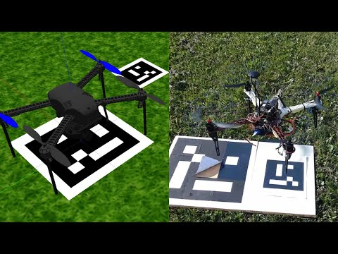

## June 24: Initial ideas and goal of the project

I always like to begin engineering projects by setting a goal. For this project, my goal is the following:

**To learn and have fun by building a launchpad and catch tower for the Starkit electric model rocket**

Based on my vision for this project, I've set some design requirements. This way, I will try to find the most efficient and cost-effective way possible of creating something that I'll be happy with:

### Design requirements

These are the absolute musts that a design should have:

- The launchpad can clamp on the rocket until ful throttle is reached
- The launchpad has rails to guide the rocket after liftoff
- The tower can catch the rocket for landing

	*I want to build a tower to catch the rocket for landing, similar to what SpaceX does with their SuperHeavy booster: https://www.youtube.com/watch?v=XGC31lmdS6s 

### Dream goals

These are not essential but they'd be cool to have:

- The launchpad can automatically launch the rocket after a catch
	- The tower can place the rocket on the launch mount
	- Hold down clamps can engage automatically
	- The launchpad can recharge the rocket while on the launch mount
- The launchpad looks as similar to Starship's launchpad and as cool as possible
	- The launchpad has got a countdown display

**Time spent: 45min**

## June 25: Research on landing methods + Research on materials for the launch mount

I've decided to start by researching the feasibility of catching Starkit between the tower arms, which would require precise data about the relative position between the two. I've come to the conclusion that it is feasible and I've decided to use a camera on the rocket to track a beacon on the launchpad. This should give the rocket enough information to accurately approach the tower, and it should give the tower enough information to close its arms in the exact position the rocket is at.

*Many drones use beacons and computer vision for performing precision landings*

I will have to do more research to figure out all of the details, but now that I know that it is feasible I will start designing the launch mount.

I've decided to start by picking a material for the structure. I think plywood would be a great option, as it's cheap and strong. However, PETG is also strong and a spool is at a similar pricepoint. I will probably need to buy a spool of PETG filament for making the tower, and if I have enough material it wouldn't make sense to buy plywood if I can just make the launch mount from PETG as well. For now I will be designing for a PETG launch mount until I am more advanced into the design.

**Time spent: 2h 45min**

## June 26 Log 1: Designing the hold down clamps and launch mount rails

Today I've researched how hold down clamps are done in other launch mount designs, and I've come up with a really simple design in which a servo would be able to engage or disengage a clamp, offloading the stress from the rocket thrust to structural parts and overcoming static friction seen in other designs.

I created a new Onshape document to verify my design and this is what I've made:

My design consists of a hinged clamp that is actuated by a servo by using a transmission mechanism. When the clamp is engaged, the force the rocket is exerting on the clamp would push against a stopper instead of trying to disengage the clamp, as shown in the video. When the servo disengages the clamp, the transmission mechanism makes the clamp push downwards slightly before going upwards. This effect is exaggerated in the video. However, to avoid the force required to push the rocket downwards while its engines are thrusting, I could modify slightly the geometry of the part in the rocket the clamps engage at, and I could use foam or dampers at the tip of the clamps as well.

Finally, I've decided to use 3D printed rails for the launch mount instead of carbon fiber rods as I was originally thinking of using. 3D printed rails provide more flexibility, are easier to manufacture and don't require any extra parts, so I've chosen to go with that.

**Time spent 2h 15min**

